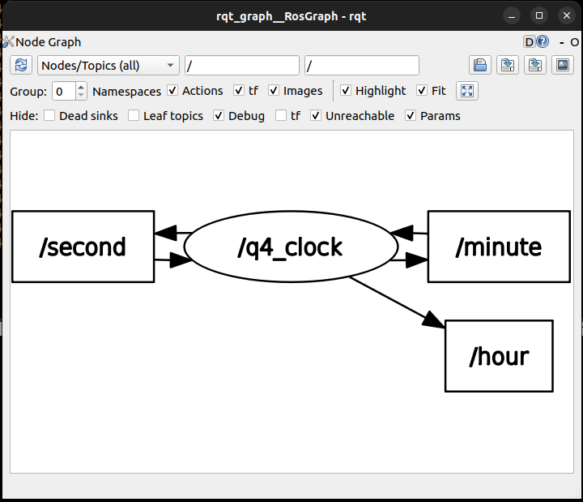

# Week 3

## Question 1

**File:** `kratos_aditya_malviya/scripts/q1_greeter.py`  
**Description:**  
Publishes `"Hello World!"` on topic `/new` at a rate of **15 messages per second**.

---

## Question 2

**File 1:** `kratos_aditya_malviya/scripts/q2_S1.py`  
**Description:**  
Publishes `'green'` on topic `/s1` for 10 seconds and then `'red'` for 10 seconds.

**File 2:** `kratos_aditya_malviya/scripts/q2_S2.py`  
**Description:**  
Subscribes to topic `/s1`.  
- If the message is `'green'`, it publishes `'red'` on `/s2`.  
- If the message is `'red'`, it publishes `'green'` on `/s2`.

---

## Question 3

**File:** `kratos_aditya_malviya/msg/RoverState.msg`  
**Description:**  
Defines a **custom message** format for the rover's state.

---

## Question 4

**File:** `kratos_aditya_malviya/scripts/q4_clock.py`  
**Description:**  
Publishes the current time on the topic `/clock`.  
Also publishes:
- **Seconds** on the topic `/second`
- **Minutes** on the topic `/minute`
- **Hours** on the topic `/hour`

### RQT Graph

### Topic List

---

## Bonus Question

**File:** `kratos_aditya_malviya/action/GoToAngle.action`  
**Description:**  
Defines a **custom action** format for the action server.

**File:** `kratos_aditya_malviya/scripts/bonus_server.py`  
**Description:**  
Moves the robotic arm by incrementing the arm's position by **1° per second** until it reaches the target angle.  
- Sends **feedback** to the client.  
- Notifies the client when the goal is **successfully achieved**.

**File:** `kratos_aditya_malviya/scripts/bonus_client.py`  
**Description:**  
Sends a **target angle** to the action server.
